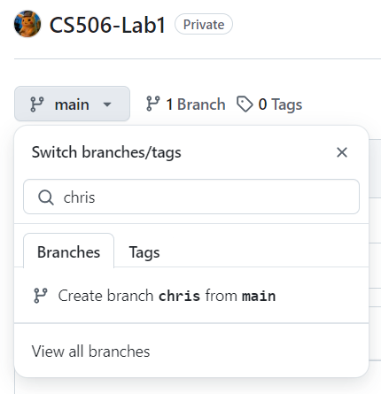
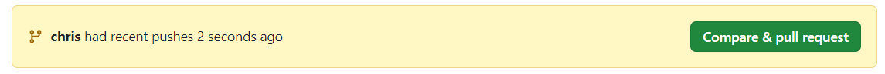
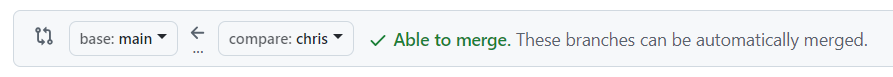
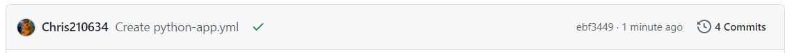

# Lab 0 Instructions
--------------------

**To get credit for the lab, please show the completed work to a lab TA. They will check you off.**

**Goals**:

1. Setup Python, Jupyter Notebook and Github.
2. Practice basic git commands.
3. Practice basic software design workflow: pull request, code review, and test-driven development.
4. Practice basic linear algebra with Numpy.

Working in pairs is recommended.

## Part 0: Install Everything

1. Install Python 3.8 or 3.10 here: [link](https://python.org/downloads).
2. Install Jupyter Notebook here: [link](https://jupyter.org/install).
3. (Optional) Install Github desktop [link](https://desktop.github.com/download).
    - Github Desktop is a nice GUI if you don't want to use command line instructions.
    - On Windows, you will need a terminal emulator to use `git` command line instructions (I like MobaXterm: [link](https://mobaxterm.mobatek.net/)).
4. Download Python libraries: `pip install numpy pytest`.
5. Follow instructions here to create a Github Authentication token: [link](https://docs.github.com/en/authentication/keeping-your-account-and-data-secure/managing-your-personal-access-tokens#creating-a-personal-access-token-classic).

## Part 1: Practicing Git

1. One of you should create a new Github repo called `CS506-Lab0`. Upload `test_utils.py` and `utils.py` to the repo using the "Add file" button. Add your partner as a collaborator under Settings -> Collaborators.
2. Both of you should navigate to the newly created repo in a browser and create a branch off of main.
    - Name the new branch your name. Both of you should have your own branch.

3. Both of you should clone your own branch locally (use either the command line or Github Desktop depending on your setup).
    - Command line: `git clone -b <your_branch> <remote_repo_url>`
    - Github Desktop: File -> Clone repository -> type in repo name -> Clone; then, switch the current branch to your own branch on the top navigation bar.
4. `test_utils.py` and `utils.py` contain missing code for you to fill out with instructions. One of you should fill in the missing code in `utils.py`, and the other should fill in `test_utils.py`.
5. Once you finish making the changes, follow these steps to commit (use either the command line or Github Desktop depending on your setup): 
    - Command line:
        * Use `git status` to list the files you modified.
        * Use `git add <filename>` to stage a file for the commit. For example: `git add test_utils.py`.
        * Use `git commit -m "commit message here"` to commit locally.
        * Use `git push` to push changes to Github. You will need to use your Github username and the authentication token generated in Part 0 (starts with `ghp_`).
    - GitHub Desktop:
        * Once you make your changes locally, you should see the changes in the Github Desktop app.
        * Type your commit message into the text box and click "Commit to <branch_name>".
        * Click the button that says "Push origin".
7. Once you have pushed changes to your branch on Github, a message should pop up in Github saying that your branch has recent changes. Click the green button that says "Compare and Pull Request".

   - Ensure that the pull request says `base:main <- compare:<branch_name>`. This means that you are requesting your changes to be merged into `main`.

   - Click "Create Pull request".
   - Ask your partner to look at the pull request you created (they can see the new pull request under the "Pull request" tab in Github). Once your partner is satisfied with the code you wrote, they should click "Merge Pull request".

## Part 2: Automated Testing

When working on a software project with many contributors, it becomes increasingly difficult to track down bugs. This is why we need automated testing after every commit. A common practice is to perform fast and simple checks after every change on the main branch and more comprehensive integration tests nightly.

For this lab, we will setup a simple automated testing workflow on Github. The workflow will check your Python syntax and run the three tests in `test_utils.py`.

1. Follow instructions here: [link](https://docs.github.com/en/actions/use-cases-and-examples/building-and-testing/building-and-testing-python#using-a-python-workflow-template)
2. Edit your newly created `.github/workflows/python-app.yml` file on Github to import `numpy` when testing, i.e. change `pip install flake8 pytest` to `pip install flake8 pytest numpy`.
3. The test should take a few seconds to run. You should see a green check mark next to your commit when done.

    - You may need to make changes to your code if the test fails. You can edit the code files directly on Github by pressing the edit icon.
5. Show the lab instructor that the test passed (green check mark appears next to latest commit).

